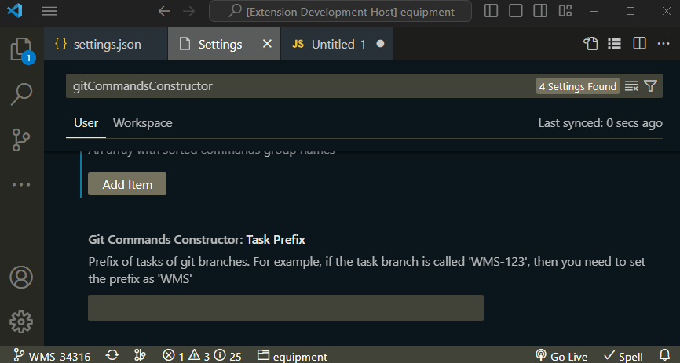

# Git Commands Constructor

Allows you to add user GIT commands with support for variables.

## Functionality

Create and run the command in a couple of clicks

You can use variables to create dynamically calculated commands. Variables are written as `$VARIABLE_NAME` in the command code. For example `git checkout $CLIPBOARD_TASK`

| Variable name       | Description |
|---------------------|-------------|
| BRANCH_TASK         | Task ID from current branch name (ex. `WMS-123`) |
| BRANCH_NAME         | Current branch name |
| CLIPBOARD_TAG       | Tag from clipboard (ex. `2.5.1`) |
| CLIPBOARD_TASK      | Task ID from clipboard (ex. `WMS-123`) |
| RELEASE_BRANCH_TAG  | Tag from release branch. If the branch is called `release/2.5.1` - then in the variable will be `2.5.1` |
| RELEASE_BRANCH_TASK | Task ID from release branch. If the branch is called `release/WMS-123` - then in the variable will be `WMS-123` |

To use variable tasks (`BRANCH_TASK`, `CLIPBOARD_TASK`, `RELEASE_BRANCH_TASK`) you need to set tasks prefix. When running the command, you can see the parsed command code

If you used a variable in the command, but when calling `Run Command`, it was not possible to get a variable (not corresponding to the name of the branch, the text in the exchange buffer, etc.) - then the command will not be shown in the list

## Extension commands

- `gitCommandsConstructor.runCommand` - Execute existing command  
